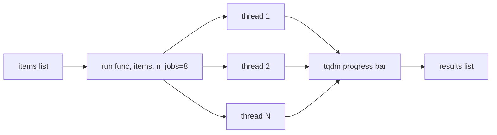

# scitex-parallel

<p align="center">
  <a href="https://scitex.ai">
    
  </a>
</p>

<p align="center"><b>Thread/process pool parallel execution utilities — `map` with tqdm, auto CPU count.</b></p>

<p align="center">
  <a href="https://scitex-parallel.readthedocs.io/">Full Documentation</a> · <code>uv pip install scitex-parallel[all]</code>
</p>

<!-- scitex-badges:start -->
<p align="center">
  <a href="https://pypi.org/project/scitex-parallel/"></a>
  <a href="https://pypi.org/project/scitex-parallel/"></a>
  <a href="https://github.com/ywatanabe1989/scitex-parallel/actions/workflows/rtd-sphinx-build-on-ubuntu-latest.yml"></a>
  <a href="https://github.com/ywatanabe1989/scitex-parallel/actions/workflows/pytest-matrix-on-ubuntu-py3-11-3-12-3-13.yml"></a>
  <a href="https://codecov.io/gh/ywatanabe1989/scitex-parallel"></a>
  <a href="https://www.gnu.org/licenses/agpl-3.0"></a>
</p>
<!-- scitex-badges:end -->

---

## Problem and Solution

| # | Problem | Solution |
|---|---------|----------|
| 1 | **`concurrent.futures` is low-level** — users rewrite "map-with-progress-bar" every project | **`stx.parallel.run(func, args)`** — drop-in `map` with tqdm, auto CPU-count; 1-liner for I/O-bound workloads (HTTP, file reads, API calls) |
| 2 | **`joblib.Parallel` is heavyweight + process-based by default** — overkill for threaded I/O | **Thread-based, no dep beyond stdlib + tqdm** — right tool for the 80% case |

## Installation

```bash
pip install scitex-parallel
```

## Quick Start

```python
from scitex_parallel import run

results = run(my_func, items, n_jobs=4)
```

## 1 Interfaces

<details open>
<summary><strong>Python API</strong></summary>

<br>

```python
from scitex_parallel import run

# I/O-bound parallel map with tqdm progress bar.
results = run(fetch_url, urls, n_jobs=8, desc="Fetching")

# Tuple-arg form for multi-arg functions.
results = run(my_func, [(a, b) for a, b in zip(xs, ys)], n_jobs=4)
```

</details>

## Architecture

```
scitex_parallel/
├── _run.py               ← `run(func, args, n_jobs=…)` thread-pool map
├── _progress.py          ← tqdm wiring (auto desc, position-safe)
├── _cpu.py               ← auto CPU-count detection
└── __init__.py           ← public surface
```

## Demo



```python
from scitex_parallel import run

urls = ["https://api.example.com/{}".format(i) for i in range(100)]
results = run(fetch_url, urls, n_jobs=8, desc="Fetching")
```

```
Fetching: 100%|████████████| 100/100 [00:04<00:00, 22.3 it/s]
```

## Part of SciTeX

`scitex-parallel` is part of [**SciTeX**](https://scitex.ai). Install via
the umbrella with `pip install scitex[parallel]` to use as
`scitex.parallel` (Python) or `scitex parallel ...` (CLI).

>Four Freedoms for Research
>
>0. The freedom to **run** your research anywhere — your machine, your terms.
>1. The freedom to **study** how every step works — from raw data to final manuscript.
>2. The freedom to **redistribute** your workflows, not just your papers.
>3. The freedom to **modify** any module and share improvements with the community.
>
>AGPL-3.0 — because we believe research infrastructure deserves the same freedoms as the software it runs on.

## License

AGPL-3.0

---

<p align="center">
  <a href="https://scitex.ai" target="_blank"></a>
</p>
